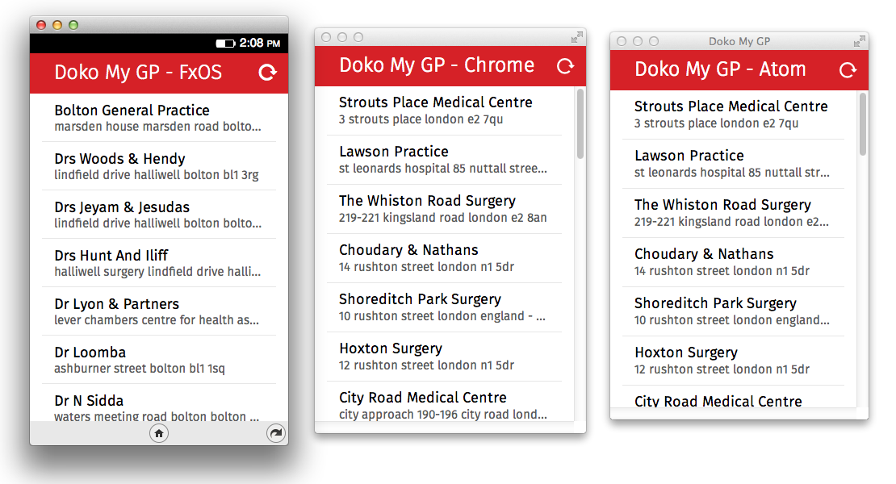

# Doko My GP

Mobile app to search a general practitioner in England.
I created it using:
- [ReactJS](http://facebook.github.io/react/) for managing the different components of the App
- [Import.io](https://import.io/) for the API data (scraped from the [NHS](http://www.nhs.uk/) website)
- [Building Blocks](http://buildingfirefoxos.com/) for the GUI
